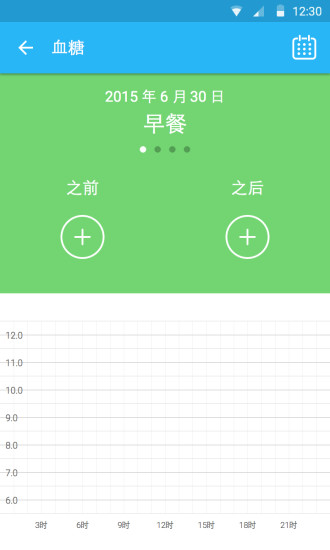
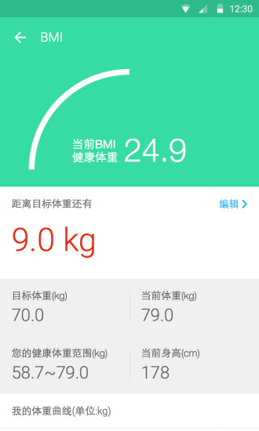

# Udr 用户端

## 简介
UDr是国内首个针对肥胖人士及糖尿病人士的健康类信息咨询与社区平台。您在这里可以：
1. 实时记录您的体重BMI、血糖以及其它各项体检数据，为您的身体保驾护航；
2. 了解更多肥胖及糖尿病常识，得到最新的医疗资讯；
3. 专业医疗团队24小时在线帮您解决肥胖与糖尿病问题；
4. 针对肥胖与糖尿病人士的温馨社区，有TA您不再孤单。

该应用为双码科技公司开发，并已上线应用宝，应用链接：[点我](https://sj.qq.com/myapp/detail.htm?apkName=com.zcmedical.tangpangquan)

## 应用截图

> 有需要完整代码或其他开发需求，请联系QQ：275753675
